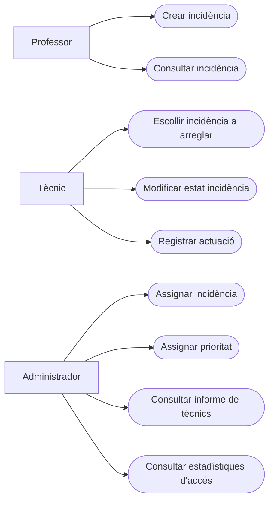

# Documentació de Programació (PROG)

## Link Taiga

https://tree.taiga.io/project/a25jawmohbou-projecte-gi3p/timeline

## Link GitHub

https://github.com/inspedralbes/projecte-1dam-25-26-dam1_grup4-1.git

## Link Penpot

https://design.penpot.app/#/view?file-id=29a60c49-971d-80dc-8007-e7079f4cf328&page-id=6778173c-fbf4-8077-8004-a37f50a5020f&section=interactions&index=0&share-id=8c927302-d076-8020-8008-00b641c8da1f

## Diagrama de casos d'ús

